# DAODES: Decentralized Ecosystems Based on DAO

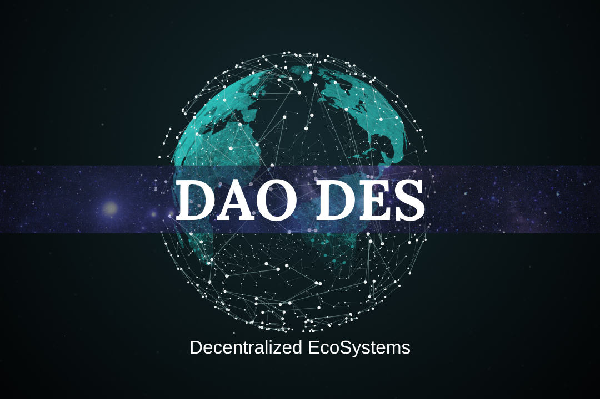

DAODES presents an innovative decentralized ecosystem built on the principles of DAO (Decentralized Autonomous Organization). Our mission is to create a universal platform for Web3 that integrates blockchain technology, decentralized applications, and unique tools for management and interaction.

## Key Advantages of DAODES

---

- [Custom Blockchain Based on Cosmos SDK](#custom-blockchain-based-on-cosmos-sdk)
- [Unique Decentralized Messenger](#unique-decentralized-messenger)
- [Native Coin and Stablecoins](#native-coin-and-stablecoins)
- [Web3 Application Platform](#web3-application-platform)
- [Unique Decision-Making System](#unique-decision-making-system)
- [Task Exchange Platform](#task-exchange-platform)
- [Reward System](#reward-system)
- [Proof of Time (PoT) Consensus](#proof-of-time-pot-consensus)
- [Activity Tracking System](#activity-tracking-system)
- [Market and Opportunities](#market-and-opportunities)
- [Financial Model](#financial-model)
- [Roadmap](#roadmap)
- [Team](#team)
- [Conclusion](#conclusion)

---

### Custom Blockchain Based on Cosmos SDK
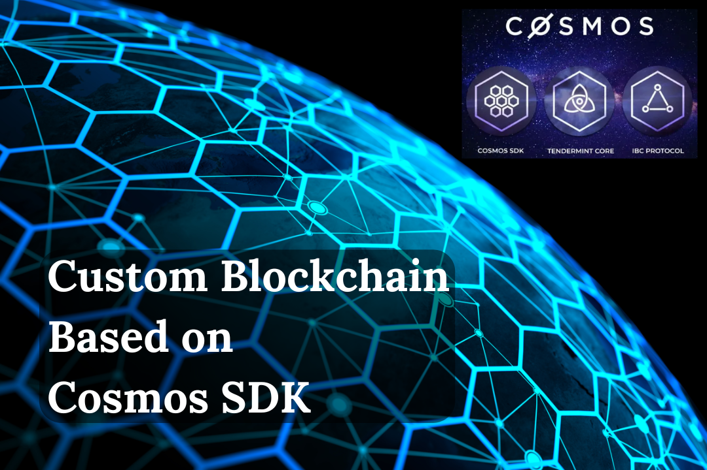

We have developed a high-performance blockchain using the open-source Cosmos SDK. It offers scalability, security, and compatibility with other blockchains in the Cosmos ecosystem. Additionally, it supports smart contracts and cross-chain interoperability.

### Unique Decentralized Messenger
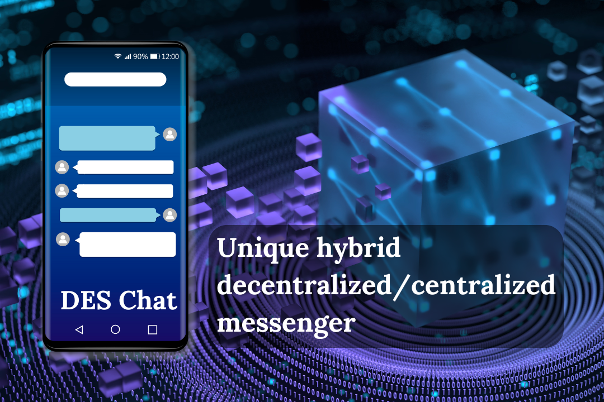

Our decentralized messenger ensures complete data privacy and security. It integrates with the DAODES ecosystem for community management and voting, making it applicable in business, education, and social projects.

### Native Coin and Stablecoins

DAODES native token (DDS) is used for transaction fees, voting, and staking. We also offer stablecoins pegged to fiat currencies and crypto assets to ensure stability and convenience in transactions.

### Web3 Application Platform
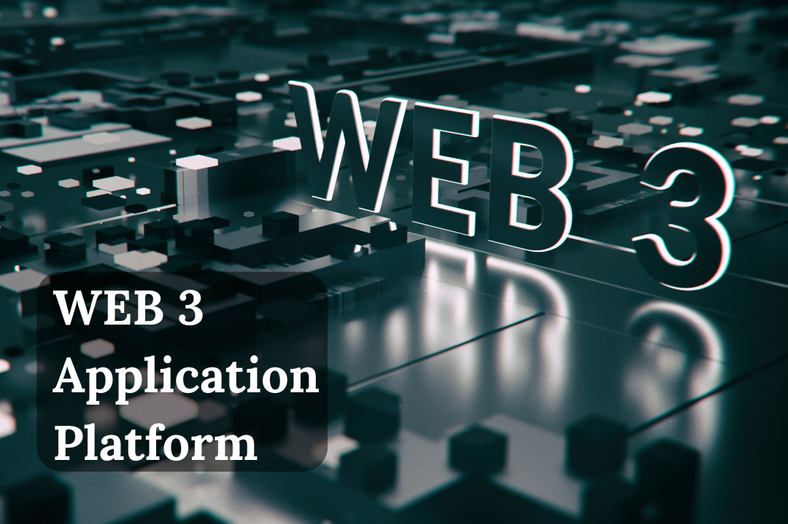

Our platform provides a universal environment for developing and launching decentralized applications (dApps). It supports various sectors, including finance, education, logistics, gaming, and social projects.

### Unique Decision-Making System
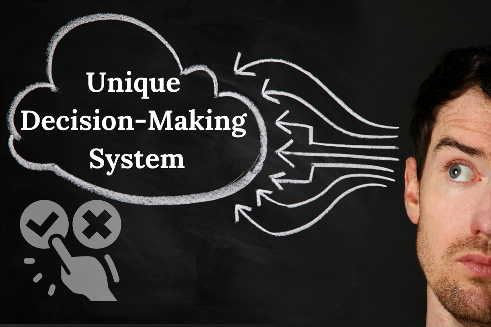

DAO decisions are recorded in IPFS (InterPlanetary File System) to ensure transparency and immutability. Every community member can submit proposals and participate in voting.

### Task Exchange Platform
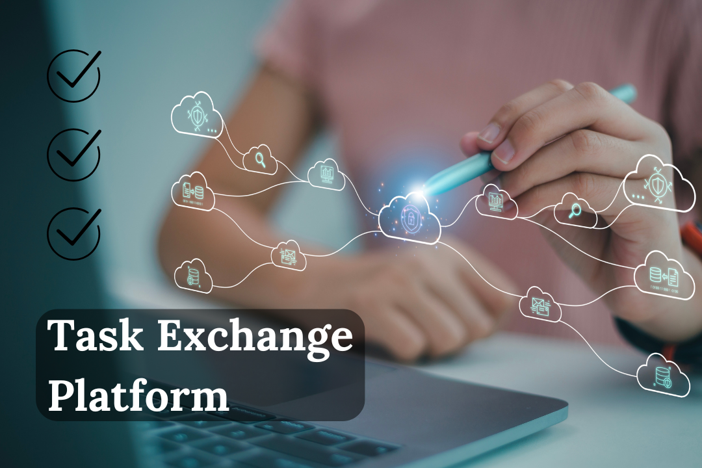

Our task exchange platform allows users to find contractors and complete tasks. Payments can be made in DAODES tokens or stablecoins, and a rating system ensures service quality.

### Reward System

Application developers receive up to 30% of transactions in their programs, incentivizing the creation of high-quality and in-demand dApps.

### Proof of Time (PoT) Consensus
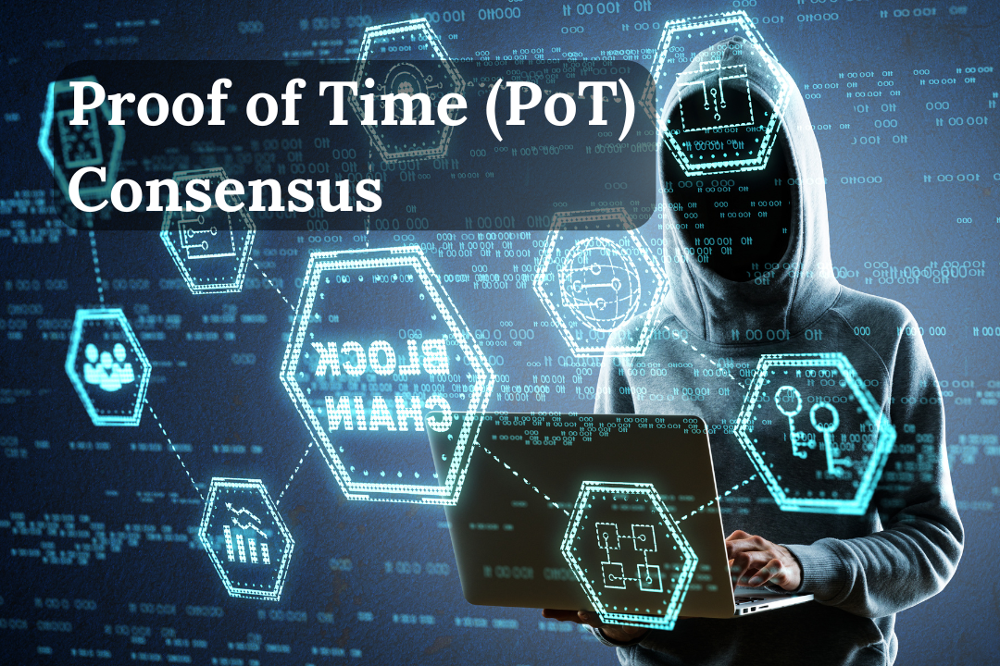

Our innovative consensus algorithm, Proof of Time (PoT), considers the time spent in the network, ensuring fair reward distribution and preventing centralization.

### Activity Tracking System
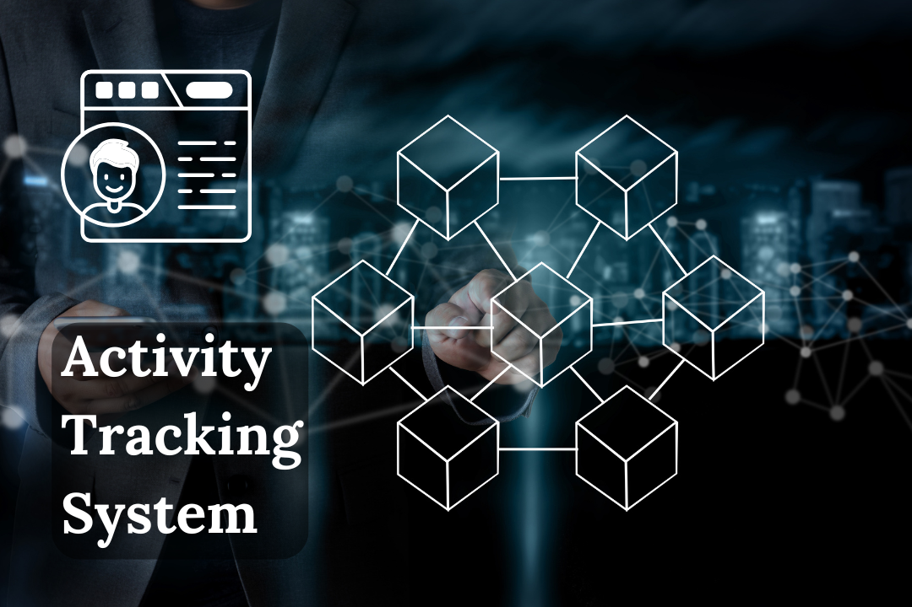

We track each participant's contribution to the ecosystem's development and limit a single participant's influence share to no more than 8%, ensuring decentralization.

### Market and Opportunities
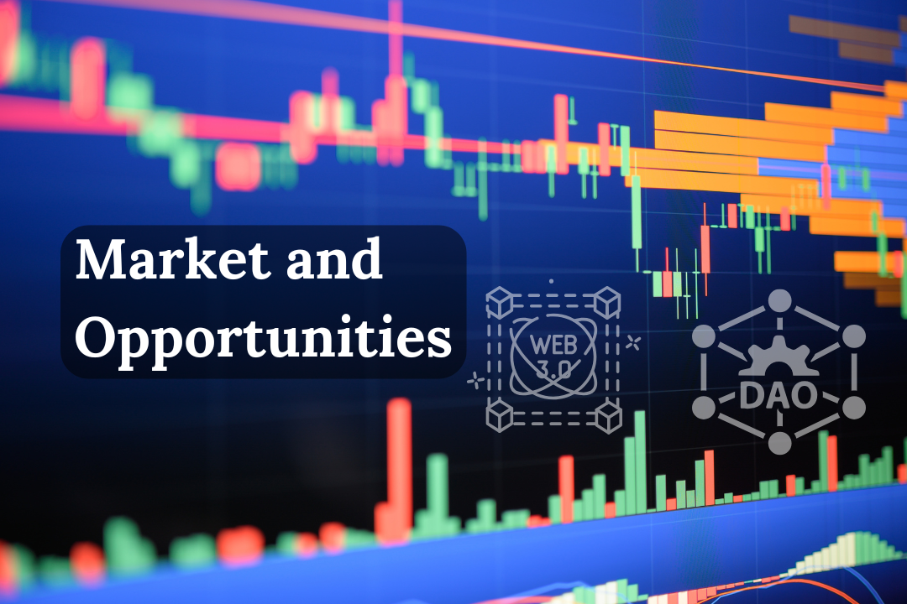

The Web3 and DAO market is growing rapidly, and DAODES occupies a unique niche by combining technologies and tools for creating decentralized ecosystems. Our platform is suitable for businesses, government organizations, startups, and communities.

### Financial Model
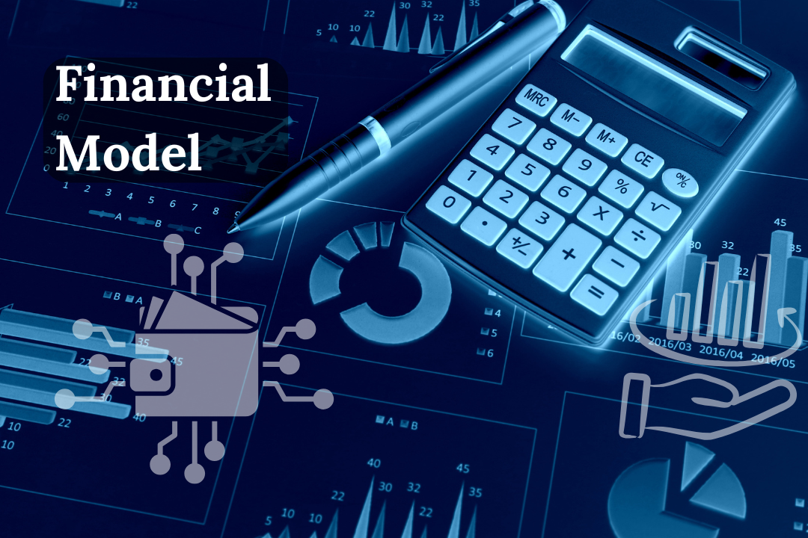

Primary revenue sources include transaction fees, platform usage fees, staking, and token issuance. Investments will be directed toward blockchain development, marketing, and team expansion.

### Roadmap
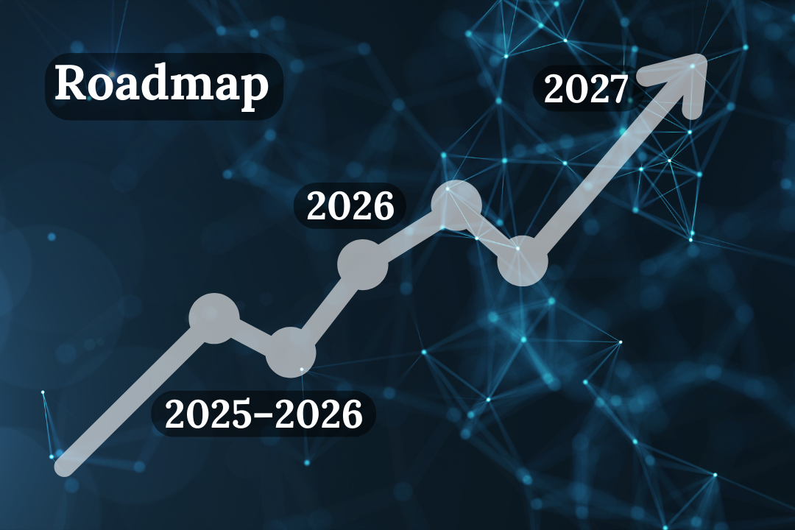

- **2025–2026:** Launch of the main blockchain network, DDS token issuance, release of the messenger, and task exchange.
- **2026:** Integration with major blockchain ecosystems, launch of the dApp platform.
- **2027:** Expansion of DAO functionality, entry into the international market.

### Team
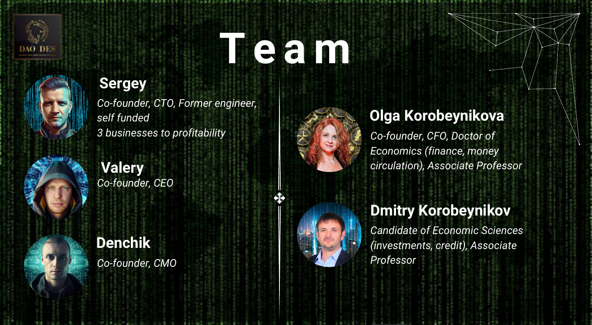

#### Our Team — Our Strength

**For more information about our team, see the <a href="https://daodes.space/team" target="_blank">link</a>**

Aims to benefit humanity through the project's technologies.

### Conclusion
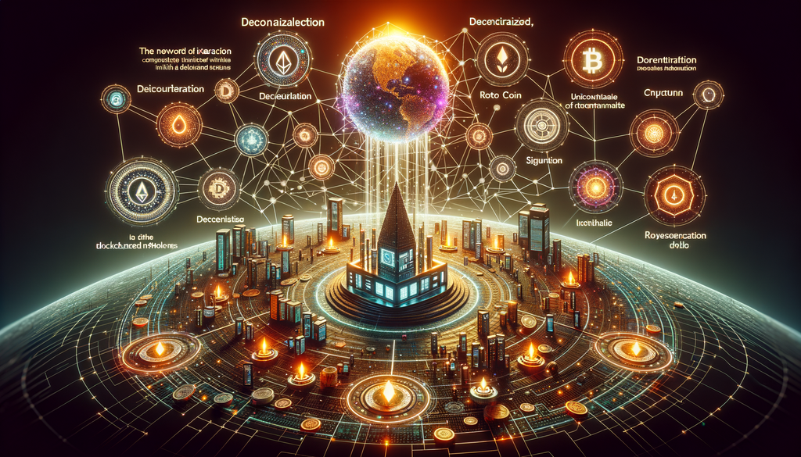

DAODES is not just a platform but a new paradigm for interaction in Web3. We offer investors a unique opportunity to be part of the revolution in decentralized technologies.

---

**Thank you for your attention! Let's build the future together!**

<a href="https://daodes.space/register" target="_blank">Become part of the team</a>
